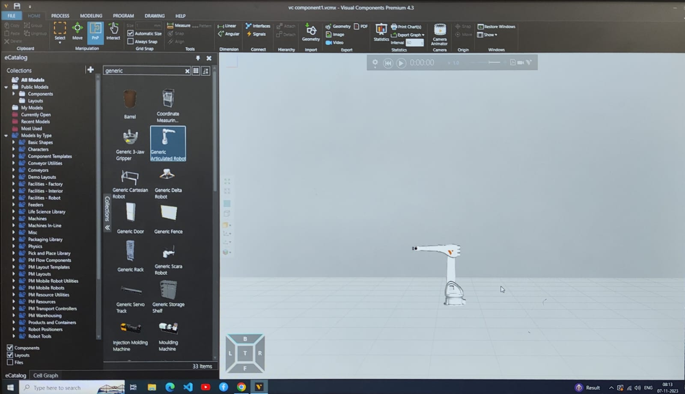
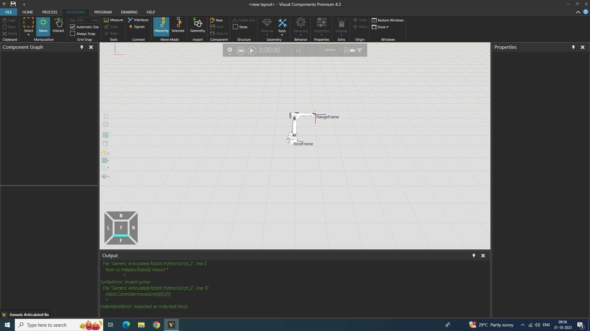

# Movement-of-Robot-Joints
## Aim:  
To move and drive the joints of the robot using python API.

## Equipment’s required:

Visual Components Premium 4.3

## Procedure:

1. 	In the eCatalog panel, Collections view, browse to Models by Type>Robots>Visual Components and then add a Generic Articulated Robot to the 3D world.
2. 	Click the Modeling tab, and then add a Python Script behaviour. The script editor will open automatically when you add the behaviour.
3. 	In the script editor, add the code and then compile the code.

## Program
```
Developed By:SANTHIYA R
Referrence Number : 212223230192
from vcScript import *
from vcHelpers.Robot2 import *
def OnRun():
  pos=[[1,30],[2,40],[3,90]]
  robot = getRobot()
  robot.driveJoints(0,0,0,0,0,0)
  delay(5)
  for i in pos:
    robot.Controller.moveJoint(i[0],i[1])
    delay(5)
```
## Output
### 1. Generic Articulated Robot


### 2. robot.driveJoints(0,0,0,0,0,0)


### 3. Movement of Joint1


### 4. Movement of Joint2


### 5. Movement of Joint3


## Result 
Thus the different robots joints are moved with the help of python list.


